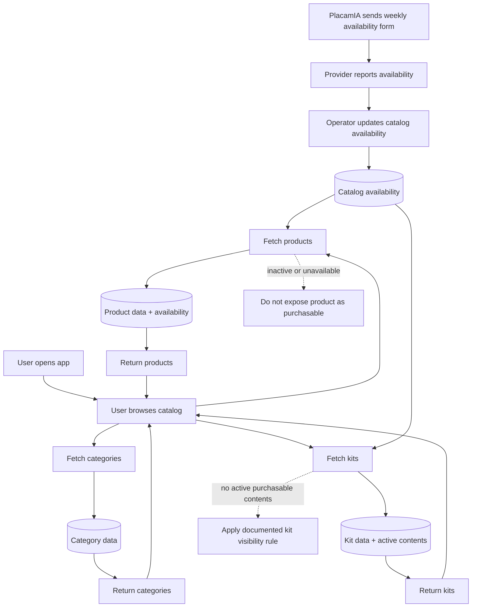

# Catalog Flow

## Purpose

Define how users browse and retrieve catalog data.

This is a read-only flow that exposes products, categories, and kits.

For the direct-checkout MVP path, the public catalog must expose only items that
are active and safe to present for the current catalog period. A manufacturing
provider does not need real-time inventory sync for MVP; provider availability
may be updated by a weekly operational process and reflected in backend catalog
data.

## Flow Diagram

## Constraints
- Catalog is public (no authentication required)
- Only active products must be returned
- Public catalog must not present an item as directly purchasable unless it is
  active, backend-priceable, and compatible with the assigned provider's
  availability state
- Weekly provider availability is a soft operational input, not exact inventory
  reservation
- No write operations allowed
- Provider availability updates are not customer-facing writes and must be
  handled through admin/operator scope when implemented

## Related Planning Docs
- `docs/planning/catalog.md`
- `docs/planning/kits.md`
- `docs/planning/provider.md`

## Security Notes

- Do not expose internal fields
- Validate query parameters
- Prevent data leakage
- Do not expose inactive, unavailable, or manual-quote-only products as direct
  checkout items
