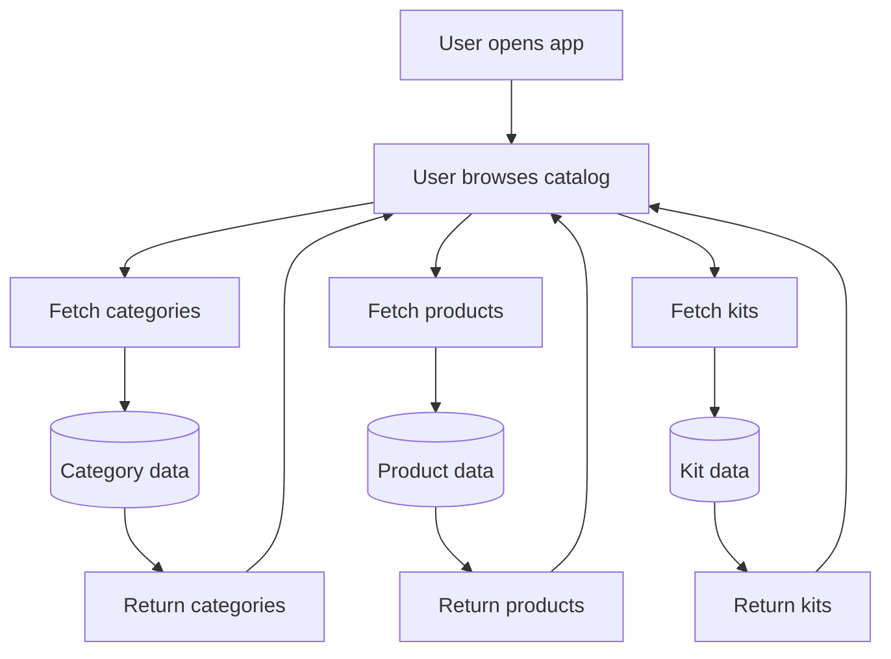

# Catalog Flow

## Purpose

Define how users browse and retrieve catalog data.

This is a read-only flow that exposes products, categories, and kits.

## Flow Diagram

## Constraints
- Catalog is public (no authentication required)
- Only active products must be returned
- No write operations allowed

## Related Planning Docs
- `docs/planning/catalog.md`

## Security Notes

- Do not expose internal fields
- Validate query parameters
- Prevent data leakage