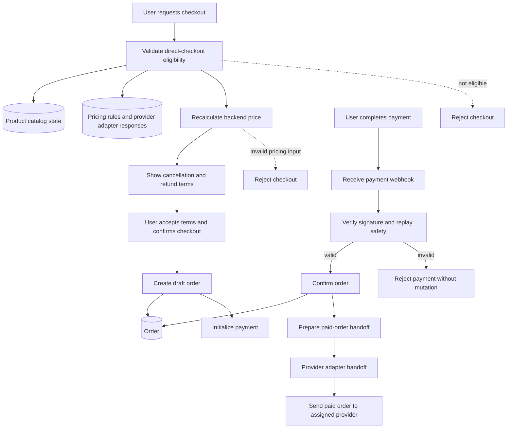
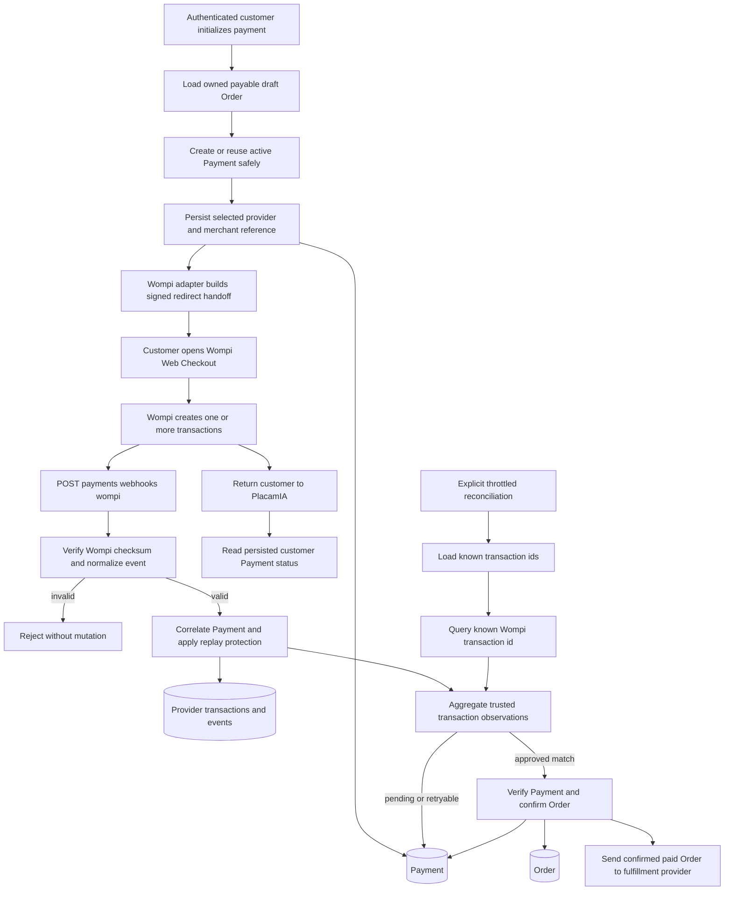

# Checkout Flow

## Purpose

Define the process from backend pricing to order creation and payment
verification.

This flow is security-critical.

The implemented checkout path is direct checkout for fully parametrizable
Products. Checkout must not wait for provider quote confirmation, but it must
reject any item that cannot be priced and validated by backend-owned rules.
Fixed-content Kits and persisted Designs have pricing previews; their order
creation paths remain separate work and do not enter this flow.

## Current Implemented Flow Diagram

---

## Approved Wompi Flow

This is the approved production payment flow. It remains pending until the
provider-specific implementation issues are complete.

The return path is navigation only. It cannot verify a Payment. The trusted
paths are an authenticated Wompi webhook and a backend-to-Wompi transaction
query validated against the persisted Payment.

---

### Key Rules
- Orders must be created from backend-validated data
- Frontend price must be ignored
- Checkout eligibility in this implemented flow is limited to active,
  fully parametrizable, backend-priceable Products.
- Fixed-content Kit pricing is public, but Kit order creation remains separate
  work.
- Persisted Design pricing is owner-scoped, revalidates current TemplateFields,
  and derives its temporary amount through `Design -> Template -> Product`, but
  it does not create an Order or enter payment initialization.
- Manual quotes and provider-confirmed pricing are out of scope for the direct
  checkout MVP path
- Cancellation and refund terms must be shown before payment
- Payment initialization must use backend-owned draft Order and OrderItem
  snapshot state; it must not accept frontend amount, currency, status,
  provider-reference, card-data, ownership, or confirmation claims
- Payment must be verified via provider webhook
- Wompi Web Checkout is the initial hosted customer payment handoff; PlacamIA
  does not collect card or bank credentials.
- Payment-provider adapters run inside the modular monolith behind a common
  registry and normalized gateway.
- The configured default provider is used only when creating a Payment; an
  existing Payment always uses its persisted provider code.
- A Payment is one checkout aggregate and may contain multiple Wompi
  transaction ids under one merchant reference.
- A declined Wompi transaction remains retryable while the checkout aggregate
  is active; any later trusted approved transaction verifies the Payment.
- Production webhooks use provider-specific routes and authentication before
  entering the common Payment lifecycle service.
- Paid-order provider handoff happens through the provider adapter boundary
  only after verified payment. This is the fulfillment-provider boundary, not
  the payment-provider gateway.

---

## Constraints
- No order is confirmed without verified payment
- Payment initialization creates or returns only an active Payment attempt; it
  does not confirm orders or trigger provider handoff
- Invalid payments must not mutate order state
- Replayed payment events must not duplicate state changes
- Frontend return URLs and query parameters must not confirm payment or mutate
  canonical Payment state.
- Customer polling returns persisted canonical state; provider reconciliation
  must be explicit and throttled.
- Manufacturing provider confirmation must not be used as a pre-payment
  checkout gate in the MVP direct-checkout path
- Products or configurations that require manual provider confirmation must be
  unavailable for direct checkout until canonical docs define their behavior

---

## Related Planning Docs
- `docs/planning/pricing.md`
- `docs/planning/orders.md`
- `docs/planning/payments.md`
- `docs/planning/provider-adapter-contract.md`
- `docs/planning/provider.md`

---

## Security Notes
- Reject invalid signatures
- Do not trust frontend confirmation
- Do not trust frontend-supplied price, availability, quantity limits, or
  ownership claims
- Do not store card data during payment initialization
- Ensure idempotency in payment handling
