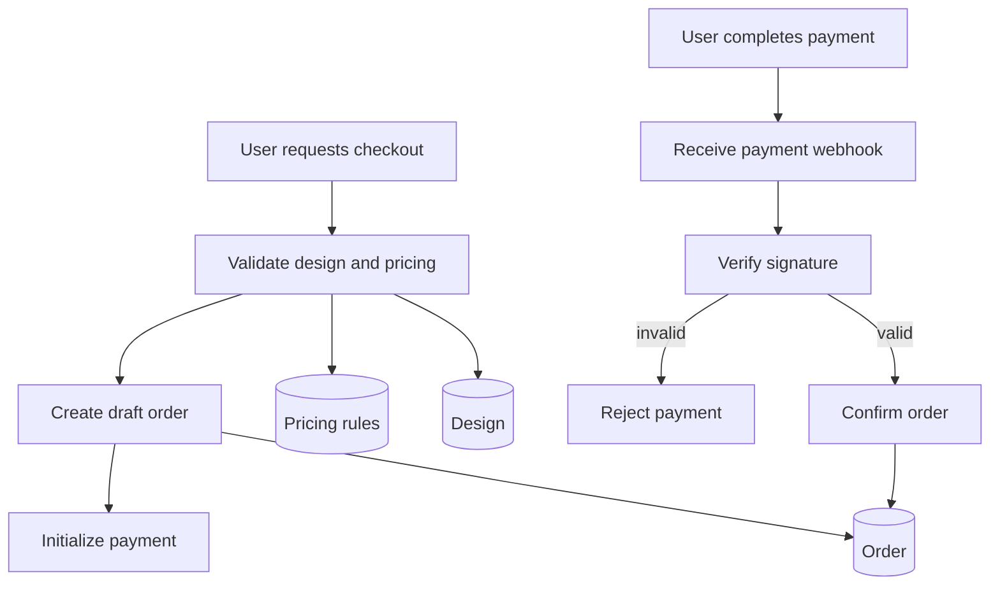

# Checkout Flow

## Purpose

Define the process from pricing confirmation to order creation and payment verification.

This flow is security-critical.

## Flow Diagram

---

### Key Rules
- Orders must be created from backend-validated data
- Frontend price must be ignored
- Payment must be verified via provider webhook

---

## Constraints
- No order is confirmed without verified payment
- Invalid payments must not mutate order state
- Replayed payment events must not duplicate state changes

---

## Related Planning Docs
- `docs/planning/pricing.md`
- `docs/planning/orders.md`
- `docs/planning/payments.md`

---

## Security Notes
- Reject invalid signatures
- Do not trust frontend confirmation
- Ensure idempotency in payment handling