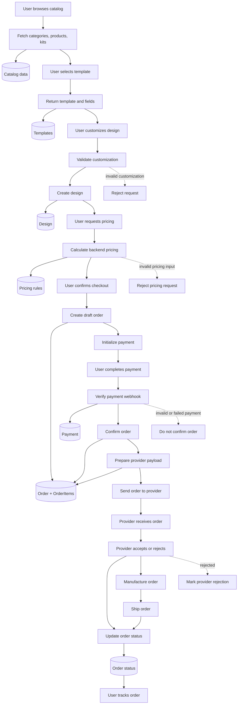
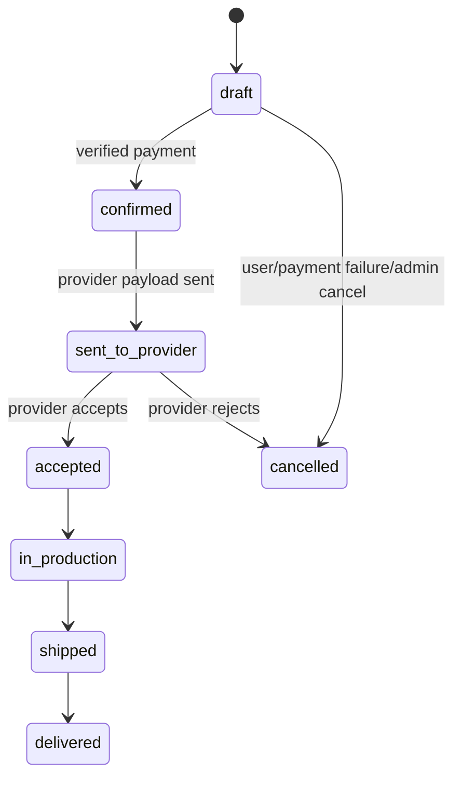

# PlacamIA Main Flow

## Purpose

This document defines the MVP system flow for PlacamIA.

It is the source of truth for the automated diagram. The visual diagram should
be generated from this flow, not maintained manually.

## Flow Diagram

## Order Status Lifecycle

## Planning Documents
- `docs/planning/foundation.md`
- `docs/planning/catalog.md`
- `docs/planning/kits.md`
- `docs/planning/templates-designs.md`
- `docs/planning/pricing.md`
- `docs/planning/orders.md`
- `docs/planning/payments.md`
- `docs/planning/provider.md`
- `docs/planning/security.md`
- `docs/planning/admin-backoffice.md`
- `docs/planning/docs.md`
- `docs/planning/mobile-placeholder.md`

## Rule

Manual diagrams are optional presentation artifacts only.

The Mermaid diagrams in this file are the canonical flow representation.
