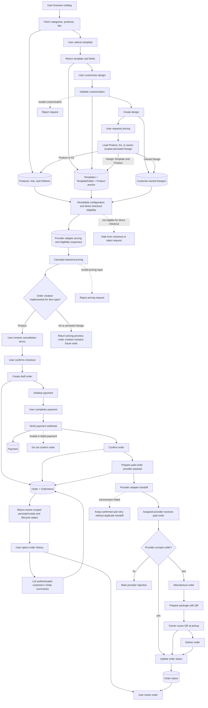
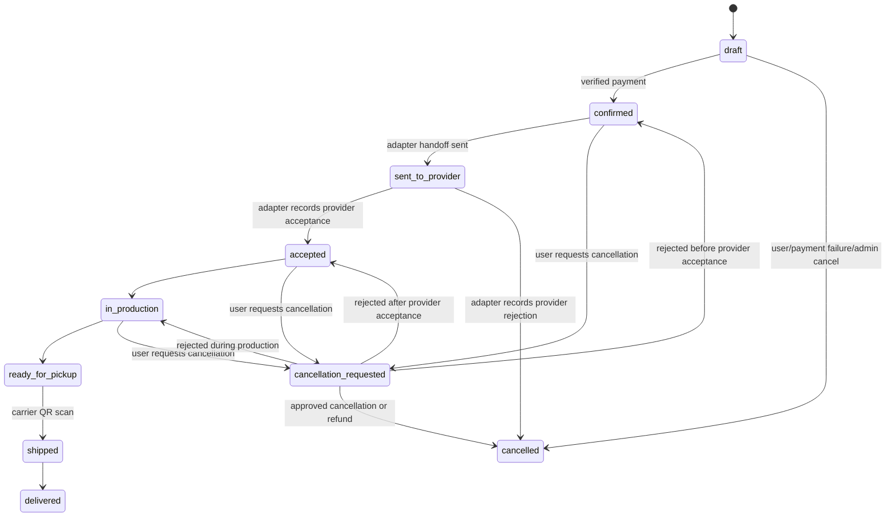

# PlacamIA Main Flow

## Purpose

This document defines the MVP system flow for PlacamIA.

It is the source of truth for the automated diagram. The visual diagram should
be generated from this flow, not maintained manually.

## MVP Product Decision

The MVP follows Path A. Product, Kit, and persisted Design configurations can be
pricing-eligible when they are fully parametrizable, compatible with provider
adapter boundary responses, and priceable by backend-owned rules. Persisted
Design pricing eligibility does not by itself implement Design order creation.

The MVP does not use an RFQ gate before checkout. Provider acceptance or
rejection happens through the provider adapter boundary after verified payment
as part of the paid-order handoff.
Products,
configurations, or kits that require manual provider quoting must not be sold
through direct checkout until their behavior is documented and approved.

## Flow Diagram

## Design Lifecycle

The MVP Design lifecycle is:

1. Template selected
2. Customization submitted
3. Customization validated by the backend
4. Design persisted only after successful validation
5. Design available for backend pricing

Rejected customization must not create a Design record. Templates and Designs
remain separate domain concepts: a Template is reusable catalog data, while a
Design is one validated customized instance derived from a Template.

Persisted Design pricing reloads the owner-scoped Design, follows its required
Template-to-Product relationship, revalidates current TemplateField rules, and
uses only backend-owned data for provider checks and arithmetic. This pricing
preview does not create an Order, Payment, or provider handoff.

## Customer Order History

Authenticated customers can list only their own persisted Order summaries
before opening tracking. The list is owner-scoped in database list and count
queries, ordered by `created_at DESC, id DESC`, and exposes persisted lifecycle,
currency, total, and timestamp fields only. It does not recalculate historical
totals or load OrderItems, Payments, customer relationships, provider details,
or cancellation provenance. Opening an entry continues to the existing
owner-scoped tracking flow without changing lifecycle ownership or mutation
rules.

## Direct Checkout Eligibility

Before pricing, the backend must verify that every Product, Kit, and persisted
Design configuration is eligible for the requested preview. Product checkout
repeats backend validation before order creation:

1. Product or Kit is active, or the persisted Design's Template and related
   Product are active
2. Provider adapter availability for the current catalog period is compatible
   with sale
3. Selected material, size, finish, quantity, and template fields are valid
4. Backend pricing rules can calculate the final amount deterministically
5. No manual quote, provider confirmation, unsupported file review, or custom
   production decision is required

If any item fails these checks, pricing is rejected and checkout must not be
initialized. Successful Kit and persisted Design previews remain pricing-only
until their order creation paths are implemented separately.

## Order Status Lifecycle

## Fulfillment Notes

PlacamIA owns the customer relationship, customer payment, customer
notifications, and order tracking. The assigned manufacturing provider produces
and prepares the order, but does not contact the customer directly in the MVP.
Partner-specific validation findings may name the provider that supplied them,
but this flow must remain provider-neutral.

The carrier QR scan is the canonical trigger for moving an accepted order from
`ready_for_pickup` to `shipped`, once the QR mechanism is technically validated
with the selected carrier. Until that validation is complete, an operator may
record the equivalent shipment event without changing the status lifecycle.

Customer cancellation after payment is a request, not an automatic mutation.
The approval rule depends on the order state and the cancellation/refund policy
agreed with the assigned provider and documented by PlacamIA. The customer must
see the applicable terms before payment.

## Planning Documents
- `docs/planning/foundation.md`
- `docs/planning/catalog.md`
- `docs/planning/kits.md`
- `docs/planning/templates-designs.md`
- `docs/planning/pricing.md`
- `docs/planning/orders.md`
- `docs/planning/payments.md`
- `docs/planning/provider-adapter-contract.md`
- `docs/planning/provider.md`
- `docs/planning/security.md`
- `docs/planning/admin-backoffice.md`
- `docs/planning/docs.md`
- `docs/planning/mobile-placeholder.md`

## Related Flow Documents

- `docs/flows/catalog-flow.md`
- `docs/flows/checkout-flow.md`
- `docs/flows/provider-fulfillment-flow.md`

## Rule

Manual diagrams are optional presentation artifacts only.

The Mermaid diagrams in this file are the canonical flow representation.
