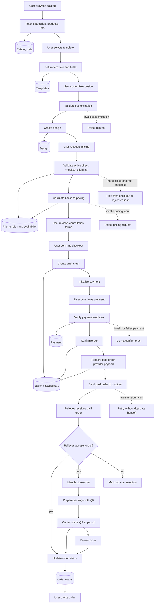
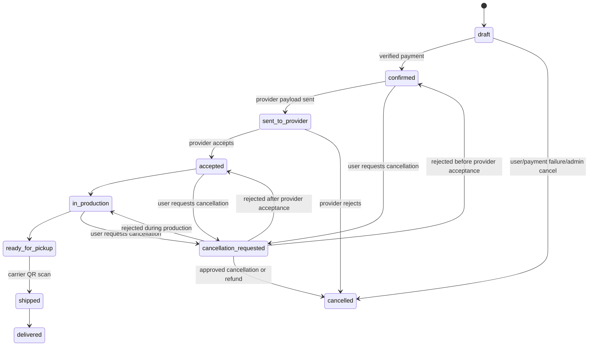

# PlacamIA Main Flow

## Purpose

This document defines the MVP system flow for PlacamIA.

It is the source of truth for the automated diagram. The visual diagram should
be generated from this flow, not maintained manually.

## MVP Product Decision

The MVP follows Path A: direct checkout for products and kits that are fully
parametrizable, available for the current catalog period, and priceable by
backend-owned rules.

The MVP does not use an RFQ gate before checkout. Provider acceptance or
rejection happens after verified payment as part of the paid-order handoff.
Products,
configurations, or kits that require manual provider quoting must not be sold
through direct checkout until their behavior is documented and approved.

## Flow Diagram

## Design Lifecycle

The MVP Design lifecycle is:

1. Template selected
2. Customization submitted
3. Customization validated by the backend
4. Design persisted only after successful validation
5. Design available for backend pricing

Rejected customization must not create a Design record. Templates and Designs
remain separate domain concepts: a Template is reusable catalog data, while a
Design is one validated customized instance derived from a Template.

## Direct Checkout Eligibility

Before pricing or checkout, the backend must verify that every product, kit, and
design configuration is eligible for direct checkout:

1. Product or kit is active in the public catalog
2. Provider availability for the current catalog period is compatible with sale
3. Selected material, size, finish, quantity, and template fields are valid
4. Backend pricing rules can calculate the final amount deterministically
5. No manual quote, provider confirmation, unsupported file review, or custom
   production decision is required

If any item fails these checks, checkout must not be initialized for that item.

## Order Status Lifecycle

## Fulfillment Notes

PlacamIA owns the customer relationship, customer payment, customer
notifications, and order tracking. Relieves de Colombia acts as the
manufacturing provider and does not contact the customer directly in the MVP.

The carrier QR scan is the canonical trigger for moving an accepted order from
`ready_for_pickup` to `shipped`, once the QR mechanism is technically validated
with the selected carrier. Until that validation is complete, an operator may
record the equivalent shipment event without changing the status lifecycle.

Customer cancellation after payment is a request, not an automatic mutation.
The approval rule depends on the order state and the cancellation/refund policy
agreed with Relieves. The customer must see the applicable terms before payment.

## Planning Documents
- `docs/planning/foundation.md`
- `docs/planning/catalog.md`
- `docs/planning/kits.md`
- `docs/planning/templates-designs.md`
- `docs/planning/pricing.md`
- `docs/planning/orders.md`
- `docs/planning/payments.md`
- `docs/planning/provider.md`
- `docs/planning/security.md`
- `docs/planning/admin-backoffice.md`
- `docs/planning/docs.md`
- `docs/planning/mobile-placeholder.md`

## Related Flow Documents

- `docs/flows/catalog-flow.md`
- `docs/flows/checkout-flow.md`
- `docs/flows/provider-fulfillment-flow.md`

## Rule

Manual diagrams are optional presentation artifacts only.

The Mermaid diagrams in this file are the canonical flow representation.
