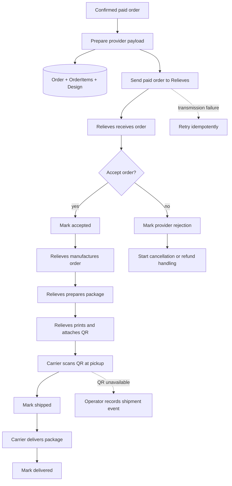
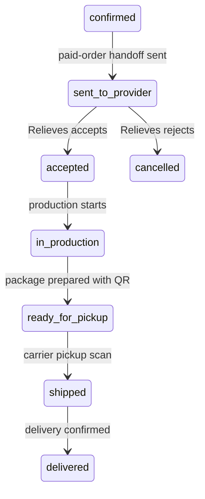

# Provider Fulfillment Flow

## Purpose

Define how a paid PlacamIA order is handed off to Relieves de Colombia and
tracked through manufacturing, pickup, shipment, and delivery.

This flow is downstream of verified customer payment. It is not an RFQ flow and
must not be used to block checkout for direct-checkout MVP items.

## Flow Diagram

## Status Mapping

## Rules

- Provider payloads must be generated from persisted backend data.
- Raw frontend payloads must never be forwarded to Relieves.
- The paid order is the production trigger.
- Relieves acceptance happens after verified payment in the direct-checkout MVP
  path.
- Provider transmission should be idempotent where possible.
- Shipment should be recorded from the QR pickup scan once the selected carrier
  integration validates that mechanism.
- Until QR pickup is technically validated, an operator may record the shipment
  event as the fallback.

## Operational Notes

PlacamIA owns customer notifications, customer complaints, customer refunds, and
customer-facing tracking. Relieves owns manufacturing and package preparation.

Customer invoicing, Relieves invoicing, PlacamIA payment to Relieves, and SLA
consequences are business/accounting processes that must be documented before
they are automated.

## Related Planning Docs

- `docs/planning/orders.md`
- `docs/planning/payments.md`
- `docs/planning/provider.md`

## Security Notes

- Do not expose internal order fields in provider payloads.
- Do not log sensitive payment data, customer secrets, or full webhook payloads.
- Failed provider transmission must not corrupt order state.
- Repeated handoff attempts must not duplicate provider orders.
