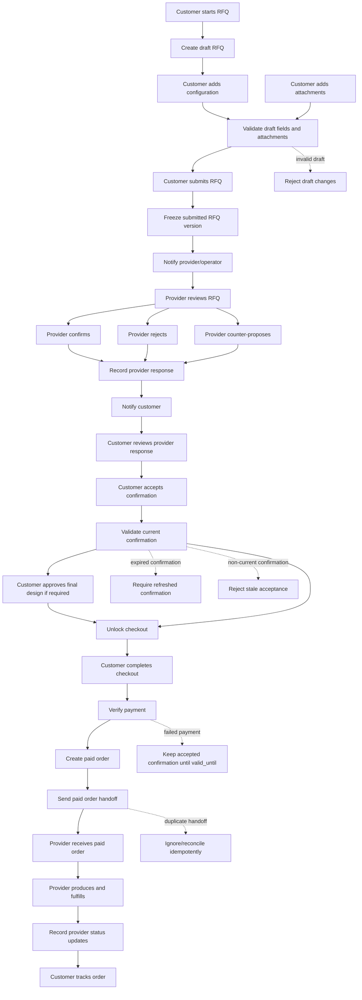
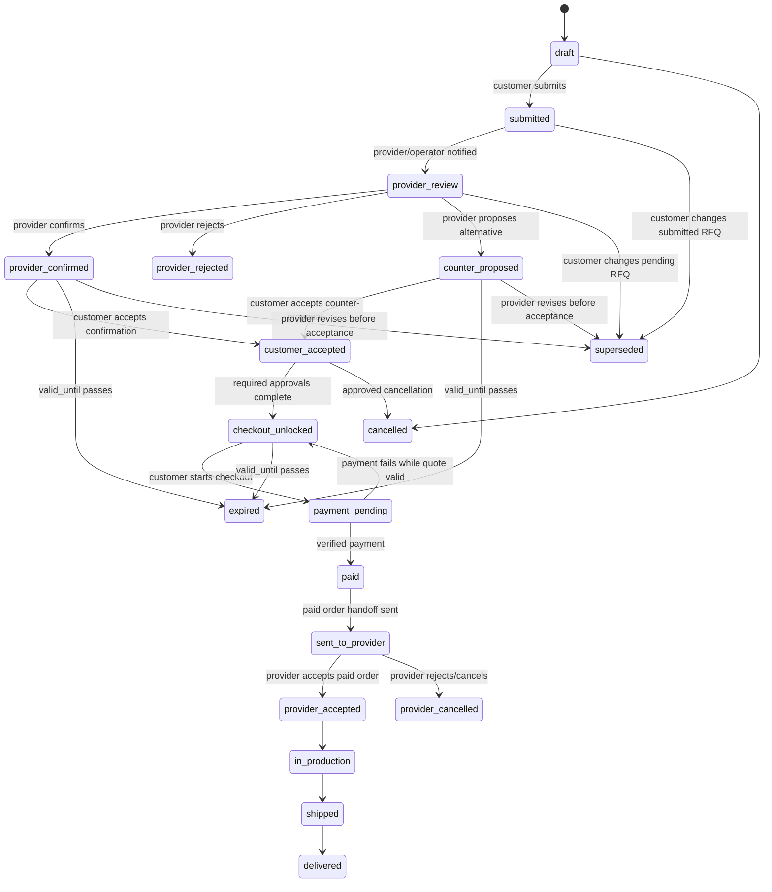

# RFQ Flow Draft

(Discovery Phase / Non-Canonical)

## MVP Status

This draft is not the MVP flow. The MVP follows Path A: direct checkout for
fully parametrizable, backend-priceable products and kits, with Relieves
acceptance or rejection after verified payment. Use `docs/flows/main-flow.md`
as the canonical MVP flow.

## Purpose

This document drafts a possible RFQ-based flow for PlacamIA.

It is not yet canonical. The current canonical MVP flow remains
`docs/flows/main-flow.md` until PlacamIA explicitly decides to pivot.

RFQ means request for quote. In this model, checkout is not available until the
provider confirms price, feasibility, lead time, production scope, and any
required approval steps.

## Proposed High-Level Flow

```text
Customer drafts RFQ
    ->
Customer submits RFQ
    ->
Provider reviews RFQ
    ->
Provider confirms, rejects, or counter-proposes
    ->
Customer accepts current provider confirmation
    ->
Customer completes checkout
    ->
PlacamIA verifies payment
    ->
PlacamIA sends paid order to provider
    ->
Provider fulfills order
    ->
Customer tracks order status
```

## Proposed Flow Diagram



## RFQ State Lifecycle



## Main Entities in the Draft Flow

### RFQ

Represents the customer's request for a quote.

Likely responsibilities:

- identify customer
- identify selected provider or provider assignment
- group RFQ versions
- track current RFQ status
- track customer-visible status

### RFQVersion

Represents one frozen version of the customer's submitted request.

Likely responsibilities:

- preserve submitted configuration
- preserve submitted attachments and addenda
- record submitted_at
- support supersession when the customer changes a submitted request

Draft RFQs may be edited. Submitted RFQ versions should not be edited in place.

### ProviderConfirmation

Represents the provider's response to an RFQ version.

Likely responsibilities:

- final price
- availability or feasibility
- lead time range
- production scope
- expiration timestamp
- cancellation/refund terms
- rejection reason or counter-proposal details
- current/active flag
- supersession history
- audit fields when operator-entered

Provider confirmations should be versioned. Only one confirmation should be
current/active for an RFQ version at a time.

### RFQAttachment

Represents a file attached to an RFQ or RFQ addendum.

Likely responsibilities:

- original filename
- storage reference
- file type
- file size
- uploaded_by
- uploaded_at
- validation status
- attachment purpose
- association with RFQ version or addendum

Attachments should be privately stored and should not automatically become
production assets.

### ProductionAsset

Represents a file approved for production use.

Likely responsibilities:

- source attachment
- provider feasibility approval
- customer design/content approval when needed
- operator mediation/audit fields
- production readiness status

## Draft RFQ Versioning Rules

1. Draft RFQs are editable before provider submission.
2. Submitted RFQ versions are frozen.
3. Customer changes after submission create a new RFQ version.
4. The prior pending version is cancelled or superseded.
5. Provider confirmation applies to one RFQ version only.
6. Customer can accept only the current active provider confirmation.
7. Changes after provider confirmation require a new or refreshed quote flow.
8. Accepted or checked-out quote details are immutable.

## Provider Response Rules

Provider may respond with:

- confirmation
- rejection
- counter-proposal
- request for clarification

Provider confirmation must include:

- final price
- availability or feasibility
- min_business_days
- max_business_days
- lead_time_note when needed
- production scope
- valid_until
- cancellation/refund terms
- required customer approval flags

If provider changes PlacamIA's suggested price, a price adjustment reason should
be required.

## Customer Acceptance Rules

Customer acceptance should require:

- current active provider confirmation
- confirmation not expired
- customer acceptance of any counter-proposal
- customer approval of final visible design/content when required
- acknowledgement of cancellation/refund terms before checkout

Acceptance should be idempotent. Repeated acceptance attempts should not create
duplicate state changes.

## Checkout Rules

Checkout unlocks only after:

- provider confirmation exists
- confirmation is current
- confirmation is not expired
- customer accepted the confirmation
- required design/content approvals are complete
- cancellation/refund terms are shown

V1 payment model:

- full payment only
- no deposits
- no partial payments
- no production payment implementation until legal/business blockers are
  resolved

If payment fails:

- no paid order is created
- accepted confirmation remains usable until valid_until
- customer may retry while valid
- after expiration, refreshed provider confirmation is required

## Paid Order Handoff Rules

The provider-confirmed quote is permission to sell. The paid order is the
production trigger.

After verified payment:

1. PlacamIA creates the paid order.
2. PlacamIA sends the paid-order handoff to the provider.
3. Provider accepts, rejects, or updates fulfillment status.
4. PlacamIA records order status changes.

Paid-order handoff must be idempotent. Retries must not create duplicate
provider orders.

## Notification Events

Customer notification events:

- RFQ submitted
- provider confirmation received
- provider rejection received
- counter-proposal received
- clarification requested
- quote expiring soon
- quote expired
- payment failed
- payment confirmed
- order sent to provider
- order status changed
- cancellation requested
- cancellation approved/rejected

Provider notification events:

- new RFQ assigned
- RFQ superseded/cancelled
- customer accepted confirmation
- customer completed payment
- paid order handoff created
- cancellation requested
- clarification added

V1 customer channels:

- email
- in-app

V1 provider channel:

- email

## Idempotency Requirements

Idempotency should be designed into:

- RFQ submission
- RFQ version supersession
- provider confirmation creation
- provider confirmation supersession
- customer confirmation acceptance
- payment webhook handling
- paid-order creation
- provider paid-order handoff
- provider order-status updates
- cancellation requests

## Security and Audit Notes

Security-sensitive areas:

- pricing
- checkout
- payment
- order ownership
- provider confirmation
- file attachments
- production assets
- cancellation/refund behavior

Audit events should capture:

- operator-entered provider confirmations
- price adjustments
- provider rejections
- counter-proposals
- customer acceptance
- final design/content approval
- payment transitions
- paid-order handoff
- cancellation decisions

Operator-entered provider confirmations should record:

- operator_user_id
- provider_contact_method
- provider_contact_reference
- confirmed_at
- full confirmation payload
- price adjustment reason category when price changes

## Open Questions

1. What are the official RFQ statuses PlacamIA should support, and which
   transitions are allowed between them? Possible statuses include: `draft`,
   `submitted`, `provider_review`, `provider_confirmed`, `counter_proposed`,
   `customer_accepted`, `expired`, `paid`, and `cancelled`. Before
   implementation, this list should become the single approved set used by the
   database, API, frontend labels, and tests.
2. Are RFQ and Quote separate concepts, or should RFQ replace Quote?
3. Does ProviderConfirmation belong to RFQVersion or Quote?
4. What is the minimum v1 RFQ schema?
5. What attachment types and size limits are allowed?
6. What provider confirmation fields are required vs optional?
7. What exact customer-facing copy should be used for confirmed quotes?
8. What does "provider accepted paid order" mean in v1 if provider already
   confirmed before checkout?
9. How should cancellation requests affect provider handoff after payment?
10. Which RFQ states must be visible to the customer?
11. Which RFQ states must be visible only internally?
12. Which legal/business answers block production checkout?

## Canonical Documentation Impact

If PlacamIA adopts this RFQ flow, the following docs need updates:

- `docs/flows/main-flow.md`
- `docs/flows/checkout-flow.md`
- `docs/planning/pricing.md`
- `docs/planning/orders.md`
- `docs/planning/payments.md`
- `docs/planning/provider.md`
- `docs/planning/templates-designs.md`
- `docs/planning/security.md`
- `docs/architecture/domain-model.md`
- `docs/architecture/testing.md`

Do not implement this flow as canonical behavior until those docs are
reconciled.
